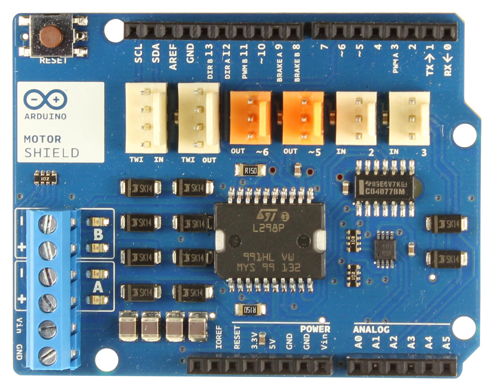
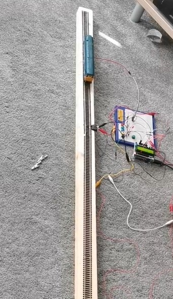
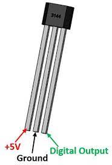
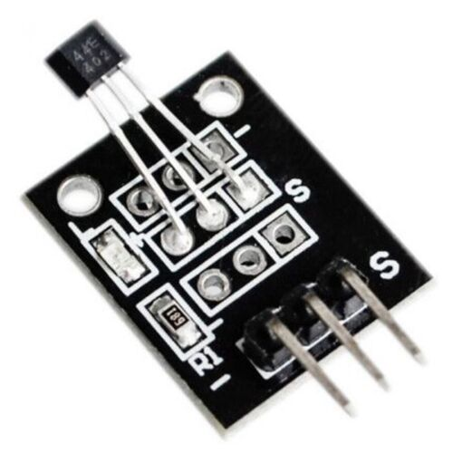
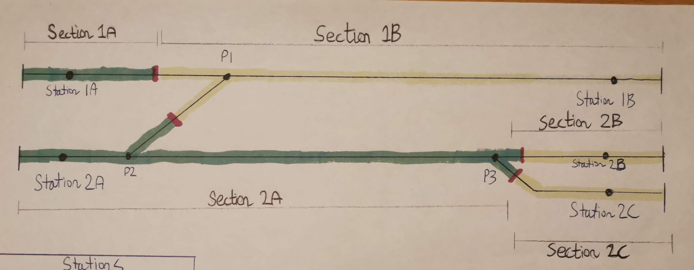
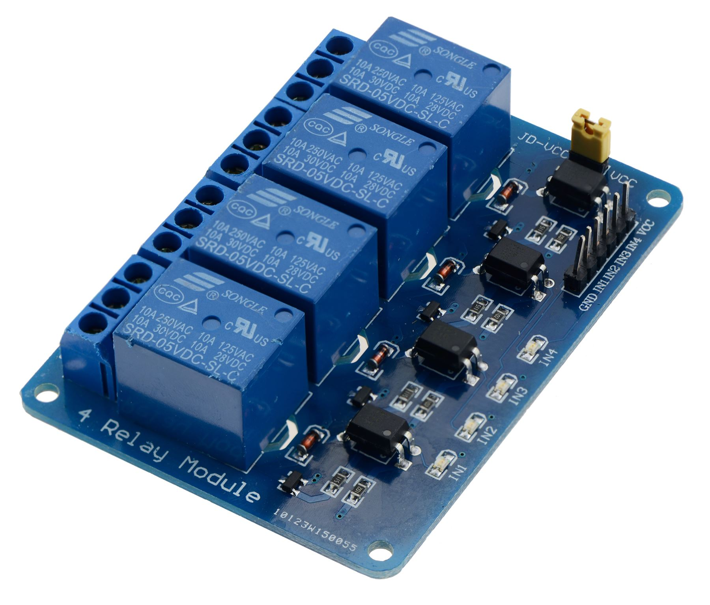
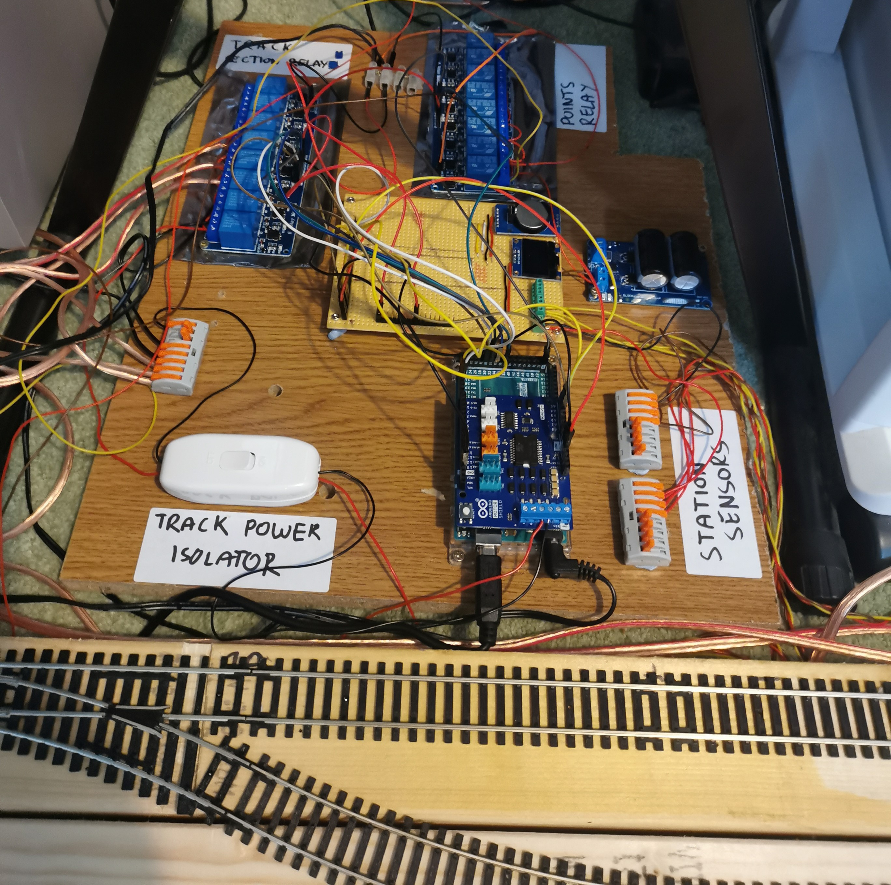
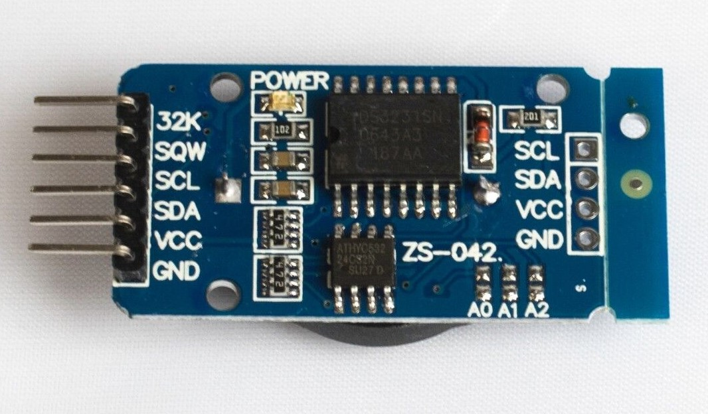

# Revive your DC Layout with Automation

This project started as a way to combine two hobbies: Model Railways and Computer Programming. It seemed to us that these should be a natural fit. By combining the two you should be able to program your trains to operate automatically, running on custom timetables and even integrating with other physical components. 

There are a few solutions out there which offer different elements of this already, but they can be limiting and can be really expensive.

## The Goal

The goal was fairly simple: "We want to operate two trains on two tracks in a simple shuttle service. The trains should have realistic acceleration, deceleration and stop in the right place at the station platform."

## DC not DCC
   
We already had a substantial DCC layout which seemed like the natural place to start but part of the joy of having a model railway is operating your own trains so we were keen not to lose this ability. In addition to this, DCC components seemed much more electrically fragile than their older DC alternatives. The chance of us accidentally shorting the track or providing the wrong voltage seemed quite likely as we experimented with our solution and we didn't fancy burning out the chips in any expensive DCC trains.

Fortunately, we had some older DC trains and this actually made the project better. Not only could we keep the DCC layout as it is with the manual control but we could revitalize the old DC trains and integrate them with the rest of the layout. DC trains would operate their automated shuttle service whilst the DCC trains would be manually operated and together it would enhance the layout.

# Phase 1: Moving a Train
## Understanding DC Trains

Before we go any further we should point out that we are not experts in this at all. We are two enthusiasts who just experimented and researched as best we could.

From the information we could find online, we found that most model railway trains operate at 12V. Each train has one or more 12V DC motors in them which rotate and therefore rotate the wheels and move the train. One rail of the track is connected to 12V and the other side is connected to ground (0V) and the current flows through the rails, through the wheels, through the motor and back to the other side. The direction of travel is controlled by changing the polarity of the signal e.g. +12V and -12V.

## Understanding Motors

We have to dive a little deeper into how these motors work as simply applying a continuous 12V signal to a motor from a plug will not make the motor spin correctly. The easiest and most straightforward solution (that we found anyway) was to use a Pulse Width Modulation (PWM) 12V signal. I won't explain why that is the case, there is a good article from [Spark Fun](https://learn.sparkfun.com/tutorials/pulse-width-modulation/all) which covers it. Fortunately for us there are standard components available that will help us with this without too much more understanding required.

## First Components

Armed with this basic information we decided we would need:

 - Arduino UNO (As I already had one, but it's cheap and perfectly suited to this)
 - Arduino Motor Shield
 - DC Train
 - Track
 - Wire etc

 The Arduino is a small microcontroller with lots of pins which allow you to connect physical components and control them with programming code. This would be the brain of the operation, the code running on the Arduino decides when to apply a voltage to the track and move the train and when to not. For example you could say "Apply 12V for 30 seconds, then don't for 30 seconds" and the outcome would be that the train would move for 30 seconds and then stop for 30 seconds.


The Arduino Motor Shield takes care of the PWM problem by having 2 dedicated terminals which output a 12V PWM signal. It's called the Motor Shield for a reason, most of these simple DC motors, like the ones used in the basic trains, are all the same design and the Arduinos built-in libraries and compatibility meant hooking this up was very straightforward.



## Prototype

For the prototype we set up a 2.4m track, connected the rails to the 12V and GND pins of the Arduino Motor Shield.



We then wrote a basic Arduino program like the following below:

```C
motorSpeedPin = 3; // Each pin or socket on the arduino has a number, refer to the Arduino Spec Sheet
motorDirectionPin = 12;

void loop() {
    // Move the train forward
    digitalWrite(motorDirectionPin, HIGH); // This line determines the polarity of the 12V output and therefore controls the direction, let's say HIGH is forwards.
    analogWrite(motorSpeedPin, 255); // This line decides what voltage to output on the 12V output, values are between 0-255 where 0 is 0V and 255 is 12V.
    delay(5000); // This will pause the program for 5 seconds (Value is in milliseconds) the 12V output will still be present during this time.


    // Stop the train
    analogWrite(motorSpeedPin, 0); // Set this to 0 to stop the train moving
    delay(3000); // Allow the train to stop for 3 seconds


    // Move the train forward
    digitalWrite(motorDirectionPin, LOW); // This will reverse the polarity and send the train backwards
    analogWrite(motorSpeedPin, 255); // Set to 12V again
    delay(5000); // Pause to let the train move back to where it started


    // Stop the train
    analogWrite(motorSpeedPin, 0); // Set this to 0 to stop the train moving
    delay(3000); // Allow the train to stop for 3 seconds
}
```

The Arduino operates on a loop and this code inside this loop function will just continuously get called.

With this basic setup the train moved back and forth in a shuttle-like motion. Success! But this first trial highlighted a number of issues:
1. We need a better mechanism than relying on delays in order to keep the train running correctly
2. We want to smooth the acceleration as it currently goes from 0 to Max straight away (More about this at the end)

# Phase 2: Detecting a Train

We managed to make a train move and stopping it is quite simple, just turn off the power, but we needed to know **when** to turn the power off in order to achieve our goal of making it stop on a particular section of track in order to look like it stopped at a station. We needed a simple detection mechanism to know when a train had passed a particular part of the track.

## Train Detection Options

There are a few articles on the internet already about this and a few products available. The top two solutions were using magnets and using infra-red. The magnet solution seemed more reliable but a bit more 'ugly' as you have to physically attach a magnet to the train but the infra-red solution, at least according to reports online, was not as reliable and vulnerable to interference. So we opted for the magnet solution.

We purchased a handful of 'hall-effect' sensors. These are very small black chips with 3 pins. They are small enough they can easily be installed under the rails between the sleepers. One pin receives a 5V, one pin is ground (0V) and the other is the 'signal'. In the absence of a strong magnetic field the output on the signal pin is the same 5V it is supplied, but in the presence of a strong magnetic field, such as a train with a magnet stuck to the bottom of it, the signal will be greater than or less than 5V depending on the polarity of the magnet. E.g. it might be 6V or 4V.



By attaching a magnet to the underside of the train we could put these sensors under the track and the Arduino would get a signal each time the train passed over it.

## Our Biggest Mistake

It is with these hall-effect sensors that we made the first major mistake. Initially we purchased the small chips themselves and wired them up. The problem with this was unreliability. The sensors would trigger before the trains got to the station and sometimes wouldn't trigger at all. Any interference could cause the signal to deviate from the expected and the computer would interpret that as a train passing overhead. It also became too difficult to define what the threshold value should be for the output signal. As the output signal is an analogue value, you know its going to be more or less than 5V but you don't know exactly. So you could say "Anything above 6V or less than 4V is definitely a hit". But there will always be that one reading that is 5.9 and suddenly it won't trigger. On top of that the input signal is never perfectly 5V, it might occasionally fluctuate between 4.9V or 5.2V so you are fighting a battle you can't win, there will always be a value that is too close to the expected deviation in the original signal or too close to the edge of detection.

Fortunately the rest of the world is aware of this and solved it with some slightly different components you can buy which are simply these sensors with some capacitors and resistors which help to smooth out this problem and make it a much more binary operation. Unfortunately for us we didn't realise this until we had installed them and had the difficult task of ripping them out and putting in the new ones!



## Reading the Sensors in the Arduino Code

Another big problem appeared during this time. The initial prototype made use of `delay(3000)`. This pauses the code execution for the duration before carrying on. We still wanted the trains to 'wait' at stations and we needed to wait whilst the train got to the station, but if the train passed over a sensor whilst we were waiting the arduino would not be able to detect it. So we needed an alternative approach.

The Arduino needed to loop and check the sensor multiple times a second if possible. So instead of waiting for 3 seconds, we could take the current time, add 3 seconds to it, and then store that variable. Then every loop we could check for sensor trigger but also check if the current time had exceeded the stored time or the 'wait' time. This also led to a problem that the internal clock of the Arduino was not accurate enough and we had to use an external module. More about that in [Date Time Module](#date-time-module).

To read the sensor in the Arduino:
```C
boolean hasSensorBeenTriggered() {
    int sensorVoltage = analogRead(sensorSignalPin);
    // 500 is 5V
    if (sensorVoltage < 500) {
        return true;
    } else {
        return false;
    }
}
```

# Phase 3: Multiple Trains

The layout below shows the track we were working on. The idea was that we had two separate tracks each with a station at either end. A train would move from station to station on one track and then wait whilst the train on the other track moved. It would give this alternating shuttle service. It is possible to get them to move at the same time but it was a complexity challenge we had not yet approached. (Ignore the points in the layout, this is discussed in a later section).



To tackle this problem we have to split the tracks into sections. DC trains are not like DCC trains, if the rails have power the trains move, so to run multiple trains you have to be able to power up individual sections only. This is simply done and combined with a few insulating track connectors to ensure isolation between rails. See the layout image above to see how we decided to split up the sections.

If we go back to our Arduino Motor Shield it only has 2 12V DC outputs and we have 5 sections of track so we needed to expand. The solution we decided on was a relay board.

## Relays

Relays are electromechanical switches. You can complete or break a circuit in the same way you can with any manual switch except you can control whether it is open or closed by supplying a voltage to a pin that controls the relay. There may be far better solutions but this is the one we found.



These blue blocks are relays and each one of these is our electro-mechanical switch for each section of track. We had to get a slightly larger one than the picture above.

# Phase 4: Final Build

The final code for the Arduino ended up quite complicated and too difficult to share but the flow of logic for each loop is something like this:
- Check for any sensors that may have been triggered
- If any have been triggered, stop the train by switching off that section of track
- Look at the routes to work out which section of track to enable next

The Arduino code had to map every pin to every sensor and section of track and then logically understand the order of trains moving. E.g. from the layout diagram a train moves from Station 1A to Station 1B by enabling track sections 1A and 1B and setting the direction of travel to forwards.

The prototype board had become a jumbled mess of wires by the time we finished adding components. It became incredibly important to be organised and to track each connection with labels and tape. We had 5 station sensors and 5 track sections all of which had to be wired to the correct pin on the arduino.



But, with all the sensors wired and placed under the tracks at the appropriate points and with the magnets attached to the bottom of the trains we were able to achieve our goal. The install was relatively easy. The only problem we had was using the wrong sensors as discussed earlier which led to a lot of scratched heads and complicated debugging.

But after that improvement, both trains run extremely reliably between their stations and operate their shuttle service.

# Future Extensions

There are some future additions we would like to explore but haven't yet.

## Points

Particularly attentive readers may have spotted in the final prototype board a second set of relays labeled 'Points relay' and they may have noticed in the track diagram multiple sections of points. Writing our code in the Arduino it is possible to trigger a set of points to switch automatically and thus increasing the complexity of the layout.

The automatic movement of points is done by a points motor. These take various forms but when activated by an electronic signal they will quickly push or pull the points across. These points motors typically operate at a slightly higher voltage and more importantly a higher current. This is due to the physical force required to push these points through so rapidly.

Fortunately again for us there is a well established way to solve this problem, the Capacitor Discharge Unit (CDU). This small device stores charge in large capacitors and can then discharge it quickly to give the points motor enough power to push the points through cleanly. The unit then takes a few seconds to recharge before it can do it again.

The CDU unit can also be triggered from a 5V signal so the Arduino can trigger a points change. We tested this on the small set up but are yet to implement it into the larger layout.

# Extra Notes

## Simulating Acceleration and Deceleration

On DC the speed of the motor is proportional to the voltage applied to it. We have talked about them being 12V motors but this is the top operating voltage and using a lower voltage results in a slower speed. There are a lot more complex and better methods of achieving this but we found having a loop which slowly increased the voltage over time would have an 'acceleration'-like effect on the trains. This is also highly dependent on the trains themselves and isn't particularly effective so we could do with finding a better way of controlling this.

## Date Time Module

Early on in prototyping we found that the internal clock of the Arduino was pretty unreliable. This would mean sleeps and pauses would sometimes be ignored and the trains would stop at their station and instantly start moving backwards. This appeared to be a known issue with Arduinos and was solved by using an Arduino compatible real-time clock (RTC).



This simple module can keep real time so we could more reliably track how many seconds the train had been waiting at a station. As this module actually keeps the date and time we could use it to operate a timetable which takes into account the actual time of day and have different routes in the morning and at night.
