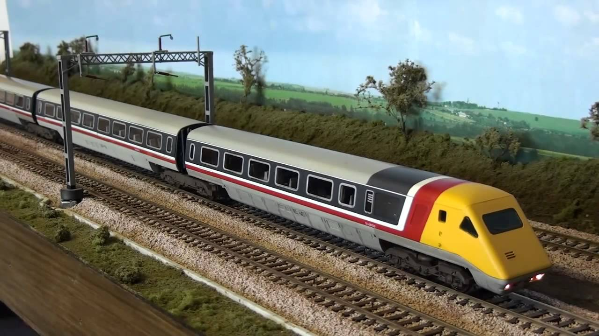
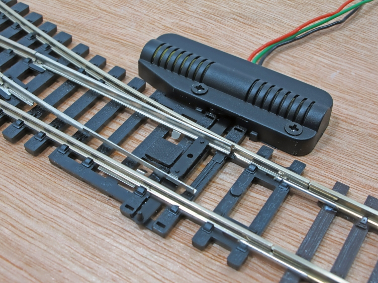

# Revive your DC Layout with Automation - Part 2

(Part 1 here [a relative link](README.md))

## Automating Points

The next phase of automating the DC Layout was to finally add an automate point to the circuit to allow the creation of more complex routes. But before that there was another problem to be solved.

## Confusing Behaviour

So far all of the trains running on the layout were very small and cheap steam engines. These were chosen in case something bad happened with the electronics and ended up damaging a train. Model Trains can be rather expensive! But now we had some confidence in the system we wanted to try some bigger trains. We had an older Hornby APT train which was much, much larger and had a bigger motor inside. But to our suprise when we put this on the track the train would move as expected, run straight over the sensor and never stop. It would just keep going and no matter what we did it would not trigger the sensor, making it completely unusable. This was very odd because as far as I could tell the train should not affect the computer at all, it was just a train on a track with a magnet, exactly the same as all the others.



After an exhaustitive search for the problem I ended up putting logging into the Arduino loop, so every loop it logged a message. This happens many times per second. When I started up the program I could see the Arduino happily sending out log messages rapidly but as soon as this heavier APT train started to move the Arduino suddenly stopped logging. The program had just completely stopped running. This is why the sensors appeared to fail as the computer was no longer checking their values.

So far the Arduino and the power to the track and all the other electronics we had added were being run with a 12V 500mA power supply. It occurred to me that perhaps that was not enough amps and this might be the cause of the odd behaviour. The small trains can probably easily run on perhaps 200mA leaving enough for the Arduino and other operations but this larger train might be stealing all of the available Amps and leaving none for the operation of the computer or at least not enough for it to run reliably.

We upgraded to a 12V 1A power supply and removed some unnecessary electronic components such as the clock and a debugging display which was no longer useful anyway. Sure enough, this fixed the issue and the heavier train could run.

## Points

We added a points motor to the points at the bottom of the track, this addition would allow 2 new routes to be added to the timetable. A points motor has 3 wires: 1 for the common ground and 1 for each direction the points can move to. I like to call these "Straight" and "Diverging". When voltage is applied to one of these wires it pushes the points into that configuration.

Using the relay board, similar to how we powered the tracks, we could also set the points for each route by selecting the appropriate "Straight" or "Diverging" pin of the points motor. When the computer selected a new "Route" it would enable the correct sections of the track like before but it would now also set the points to the correct configuration for that route.



## Final Code Configuration

We can best see how this works by looking at the final code configuration. A large refactor was done to the codebase to allow for simple configuration.

```
// Here we declare a simple enum type where we list and give friendly names to the number of stations we have on the layout
enum Station {
  STATION_1A,
  STATION_1B,
  STATION_2A,
  STATION_2B,
  STATION_2C
};

// Here we declare a list of all the available routes we can make, we use the convention of a station to station. E.g. R_1A_TO_1B is simply a route from STATION_1A to STATION_1B
enum Route {
  R_1A_TO_1B,
  R_1B_TO_1A,
  R_2A_TO_2B,
  R_2B_TO_2A,
  R_2A_TO_2C,
  R_2C_TO_2A
};

// This lists the pins in the Arduino which are connected to the sensors. The order must match the order of the station enum.
int stationSensorPins[NUMBER_OF_STATIONS] = {
  // These are all Analog pins on the Arduino
  5,  // STATION_1A
  4,  // STATION_1B
  3,  // STATION_2A
  9,  // STATION_2B
  8   // STATION_2C
};

// This lists all the pints which enable/disable sections of the track.
int trackSectionPins[NUMBER_OF_SECTIONS] = {
  // These are all Digital pins on the Arduino
  30,  // 1A
  31,  // 1B
  32,  // 2A
  33,  // 2B
  34   // 2C
};

// This two-dimensional array tells you which sections of track need to be enabled for each route. The order here must match the order of the Route enum.
int routeSections[NUMBER_OF_ROUTES][NUMBER_OF_SECTIONS] = {
  // R_1A_TO_1B
  { TRACK_ON, TRACK_ON, TRACK_OFF, TRACK_OFF, TRACK_OFF },
  // R_1B_TO_1A
  { TRACK_ON, TRACK_ON, TRACK_OFF, TRACK_OFF, TRACK_OFF },

  // R_2A_TO_2B
  { TRACK_OFF, TRACK_OFF, TRACK_ON, TRACK_ON, TRACK_OFF },
  // R_2B_TO_2A
  { TRACK_OFF, TRACK_OFF, TRACK_ON, TRACK_ON, TRACK_OFF },

  // R_2A_TO_2C
  { TRACK_OFF, TRACK_OFF, TRACK_ON, TRACK_OFF, TRACK_ON },
  // R_2C_TO_2A
  { TRACK_OFF, TRACK_OFF, TRACK_ON, TRACK_OFF, TRACK_ON },
};

// This describes which station we expect to hit on each route
int routeStations[NUMBER_OF_ROUTES][NUMBER_OF_STATIONS_PER_ROUTE] = {
  // R_1A_TO_1B
  { STATION_1B },
  // R_1B_TO_1A
  { STATION_1A },
  // R_2A_TO_2B
  { STATION_2B },
  // R_2B_TO_2A
  { STATION_2A },
  // R_2A_TO_2C
  { STATION_2C },
  // R_2C_TO_2A
  { STATION_2A }
};

// This describes the pins connected to the ardunio for each connection of the point motor. By convention we always have the pin connected to the "straight" side first
int pointsPins[NUMBER_OF_POINTS][2] = {
  // Straight PIN, Diverging PIN
  {39, 38}
};


// This describes how the point should be set for each of the available routes
int routePoints[NUMBER_OF_ROUTES][NUMBER_OF_POINTS] = {
  // 1A_TO_1B
  {DIVERGING},
  // 1B_TO_1A
  {DIVERGING},

  // 2A_TO_2B
  {DIVERGING},
  // 2B_TO_2A
  {DIVERGING},

  // 2A_TO_2C
  {STRAIGHT},
  // 2C_TO_2A
  {STRAIGHT}
};

// This describes the timetable, which routes should be run and in what order. This timetable loops forever so the trains have to get back into the correct starting positions by the end so the cycle can start again.
int timetable[NUMBER_OF_TIMETABLE_ENTRIES][2] = {
  { R_2A_TO_2B, FORWARD },
  { R_1B_TO_1A, BACKWARD  },
  { R_2C_TO_2A, BACKWARD },
  { R_1A_TO_1B, FORWARD },
  { R_2A_TO_2C, FORWARD  },
  { R_2B_TO_2A, BACKWARD  }
};
```

All of this code defines configuration objects which are passed into the proper program. The program starts mainly with the timetable. We start with the first entry of the timetable which declares the route to be travelled, the route can then be looked up in the **routePoints** and **routeSections** object which tells the computer how to set the sections and how to set the points for that route. The program then uses the **pointsPins** and **trackSectionPins** to further lookup and send the appropriate signal to those specific pins. Then the train can finally move. Whilst the train is moving the program continually looks for the expected station on this route from the **routeStations** object which again it uses the **stationPins** object to work out which pin of the Arduino to check for a specific station. When it finds that has been detected the train stops and moves to the next item in the timetable for the whole operation to begin again.

As I write these I see a number of further improvements that could be made to the code to simplify this such as changing the Station enums to be objects so their pins can be set inside, similary routes should contain their direction instead of it being in the timetable as that makes no sense.
